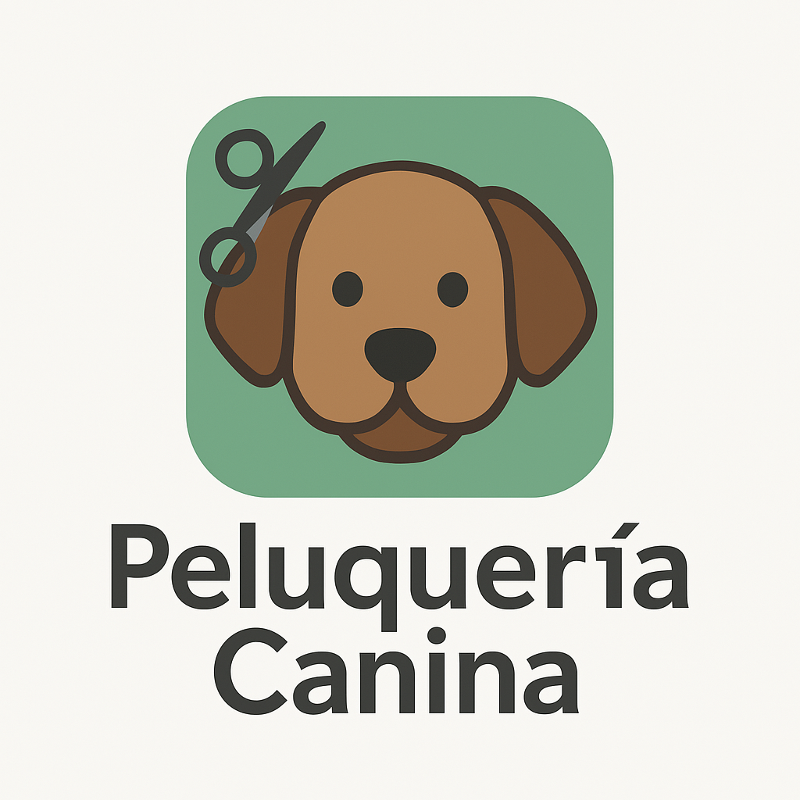

# peluqueria_canina
<p align="center">
  
</p>

# 🐶 Peluquería Canina - Gestión de Mascotas

Este proyecto es una aplicación de escritorio en Java que permite gestionar los datos de mascotas y sus dueños en una peluquería canina. La interfaz gráfica está hecha con Java Swing, y el sistema gestiona operaciones CRUD sobre los registros almacenados.

---

## 🚀 Funcionalidades

- Alta de mascotas con información del dueño.
- Modificación y eliminación de mascotas.
- Listado de todas las mascotas registradas.
- Ventana gráfica amigable con interfaz construida en Swing.

---

## 🛠️ Tecnologías utilizadas

- Java 8+
- Java Swing
- JPA / Eclipse (para la persistencia)
- Maven o Gradle (opcional según tu configuración)
- IDE recomendado: NetBeans / IntelliJ IDEA

---

## 📦 Estructura del proyecto

```
com.mycompany.peluqueriacaninaproject
├── PeluqueriaCaninaProject.java     # Clase principal
├── logica/
│   ├── Controladora.java            # Lógica general de negocio
│   ├── Mascota.java                 # Entidad Mascota
│   └── Dueno.java                   # Entidad Dueño
├── persistencia/                    # (No incluido pero referenciado en Controladora)
└── igu/                             # (Interfaz gráfica - clases no incluidas pero mencionadas)
```

---

## 🧪 Cómo ejecutar

1. Clona el repositorio o descarga los archivos.
2. Abre el proyecto en tu IDE favorito.
3. Asegúrate de tener configurada la base de datos y la conexión JPA.
4. Ejecutá la clase `PeluqueriaCaninaProject.java`.
5. Se abrirá una ventana con la interfaz principal.

---

## 👤 Autor

- Desarrollado por Matías Almeira

---

## 📃 Licencia

Este proyecto está bajo la Licencia MIT - ver el archivo `LICENSE` para más detalles.

---

## 🤝 Contribuciones

¡Las contribuciones son bienvenidas! Podés abrir issues o enviar pull requests si querés mejorar algo o agregar nuevas funcionalidades.
